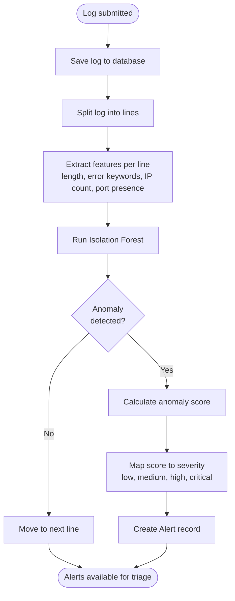
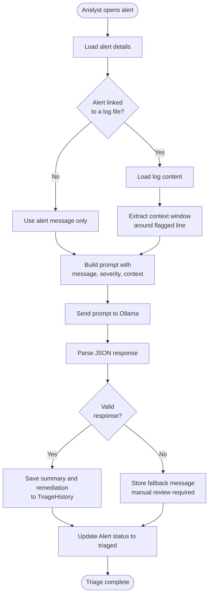
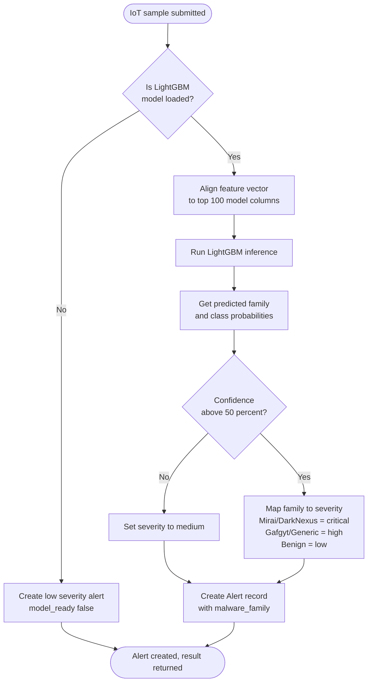

# BPMN Diagrams

## 1. Log Analysis Process

```mermaid
flowchart TD
    Start([Log submitted]) --> Upload[Save log to database]
    Upload --> Parse[Split log into lines]
    Parse --> Features[Extract features per line\nlength, error keywords, IP count, port presence]
    Features --> Model[Run Isolation Forest]
    Model --> Check{Anomaly\ndetected?}
    Check -- No --> NextLine[Move to next line]
    NextLine --> Done
    Check -- Yes --> Score[Calculate anomaly score]
    Score --> Severity[Map score to severity\nlow, medium, high, critical]
    Severity --> CreateAlert[Create Alert record]
    CreateAlert --> Done([Alerts available for triage])
```

---

## 2. Alert Triage Process

```mermaid
flowchart TD
    Start([Analyst opens alert]) --> LoadAlert[Load alert details]
    LoadAlert --> HasLog{Alert linked\nto a log file?}
    HasLog -- Yes --> LoadLog[Load log content]
    HasLog -- No --> NoContext[Use alert message only]
    LoadLog --> Context[Extract context window\naround flagged line]
    NoContext --> Prompt
    Context --> Prompt[Build prompt with\nmessage, severity, context]
    Prompt --> Ollama[Send prompt to Ollama]
    Ollama --> Parse[Parse JSON response]
    Parse --> Valid{Valid\nresponse?}
    Valid -- Yes --> Save[Save summary and remediation\nto TriageHistory]
    Valid -- No --> Fallback[Store fallback message\nmanual review required]
    Save --> UpdateStatus[Update Alert status to triaged]
    Fallback --> UpdateStatus
    UpdateStatus --> Done([Triage complete])
```

---

## 3. IoT Malware Classification Process

```mermaid
flowchart TD
    Start([IoT sample submitted]) --> ModelCheck{Is LightGBM\nmodel loaded?}
    ModelCheck -- No --> NoModel[Create low severity alert\nmodel_ready false]
    NoModel --> Done
    ModelCheck -- Yes --> Align[Align feature vector\nto top 100 model columns]
    Align --> Infer[Run LightGBM inference]
    Infer --> Predict[Get predicted family\nand class probabilities]
    Predict --> ConfCheck{Confidence\nabove 50 percent?}
    ConfCheck -- No --> MedSeverity[Set severity to medium]
    ConfCheck -- Yes --> FamilyMap[Map family to severity\nMirai/DarkNexus = critical\nGafgyt/Generic = high\nBenign = low]
    MedSeverity --> CreateAlert[Create Alert record\nwith malware_family]
    FamilyMap --> CreateAlert
    CreateAlert --> Done([Alert created, result returned])
```
