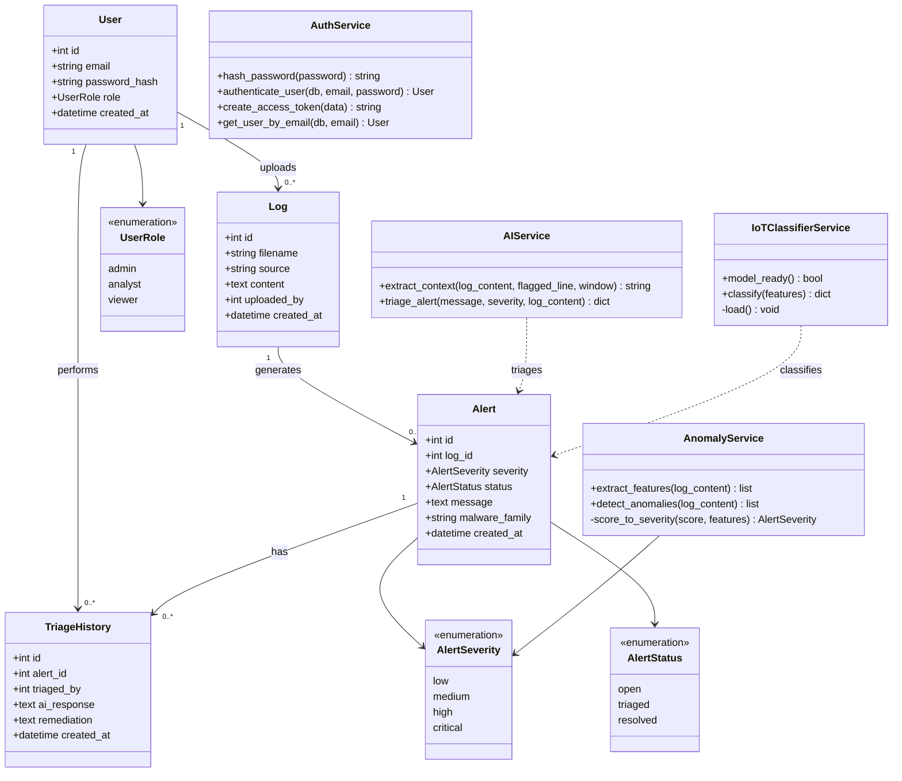

# Class Diagram

```mermaid
classDiagram
    class User {
        +int id
        +string email
        +string password_hash
        +UserRole role
        +datetime created_at
    }

    class Log {
        +int id
        +string filename
        +string source
        +text content
        +int uploaded_by
        +datetime created_at
    }

    class Alert {
        +int id
        +int log_id
        +AlertSeverity severity
        +AlertStatus status
        +text message
        +string malware_family
        +datetime created_at
    }

    class TriageHistory {
        +int id
        +int alert_id
        +int triaged_by
        +text ai_response
        +text remediation
        +datetime created_at
    }

    class AlertSeverity {
        <<enumeration>>
        low
        medium
        high
        critical
    }

    class AlertStatus {
        <<enumeration>>
        open
        triaged
        resolved
    }

    class UserRole {
        <<enumeration>>
        admin
        analyst
        viewer
    }

    class AuthService {
        +hash_password(password) string
        +authenticate_user(db, email, password) User
        +create_access_token(data) string
        +get_user_by_email(db, email) User
    }

    class AnomalyService {
        +extract_features(log_content) list
        +detect_anomalies(log_content) list
        -score_to_severity(score, features) AlertSeverity
    }

    class AIService {
        +extract_context(log_content, flagged_line, window) string
        +triage_alert(message, severity, log_content) dict
    }

    class IoTClassifierService {
        +model_ready() bool
        +classify(features) dict
        -load() void
    }

    User "1" --> "0..*" Log : uploads
    User "1" --> "0..*" TriageHistory : performs
    Log "1" --> "0..*" Alert : generates
    Alert "1" --> "0..*" TriageHistory : has
    Alert --> AlertSeverity
    Alert --> AlertStatus
    User --> UserRole
    AnomalyService --> AlertSeverity
    AIService ..> Alert : triages
    IoTClassifierService ..> Alert : classifies
```
