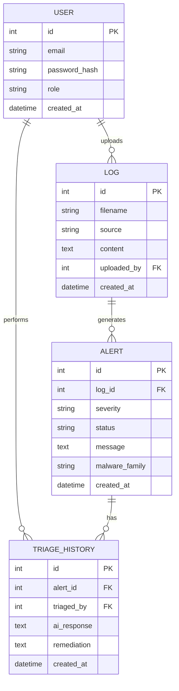

# Entity Relationship Diagram

## Notes

- `ALERT.log_id` is nullable. Alerts generated from IoT submissions are not linked to a log file.
- `ALERT.malware_family` is nullable. Only populated for IoT-sourced alerts where the model is loaded and returns a valid prediction.
- `ALERT.severity` is one of: low, medium, high, critical.
- `ALERT.status` is one of: open, triaged, resolved.
- `USER.role` is one of: admin, analyst, viewer.
