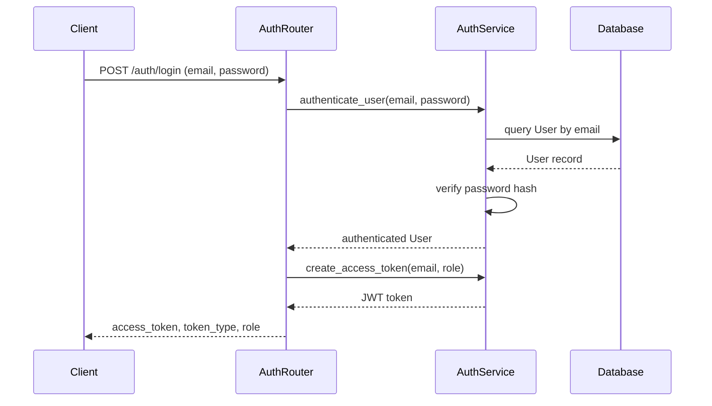
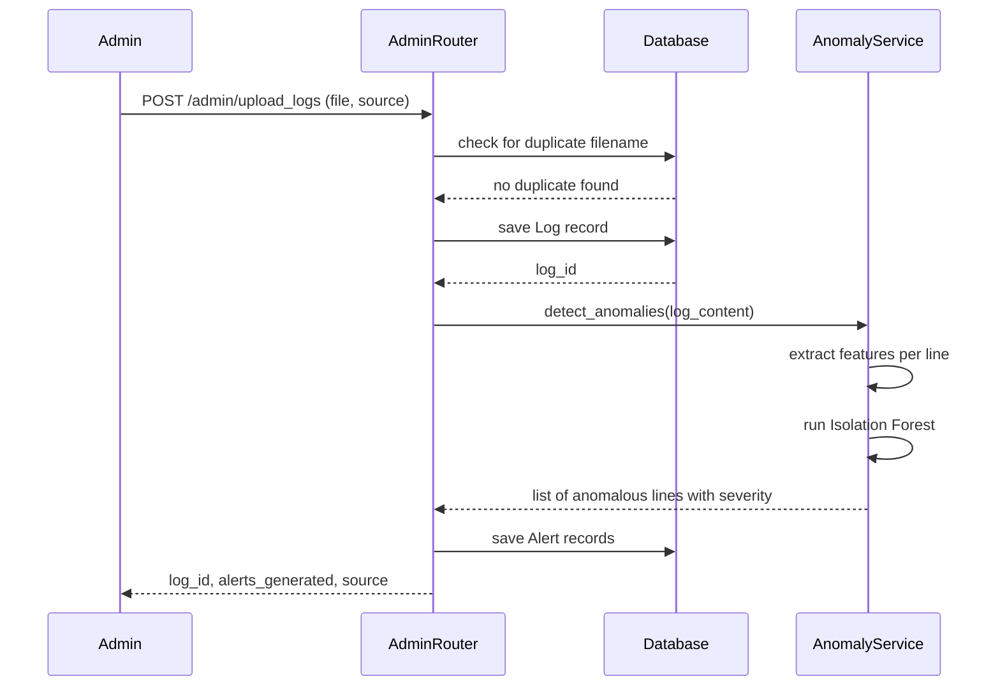
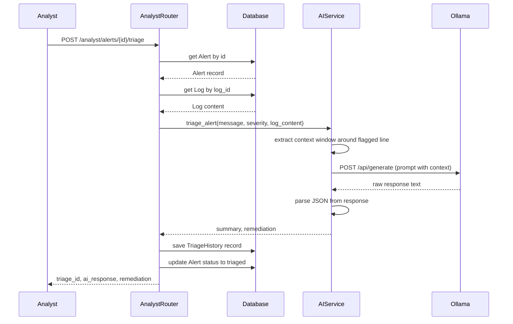
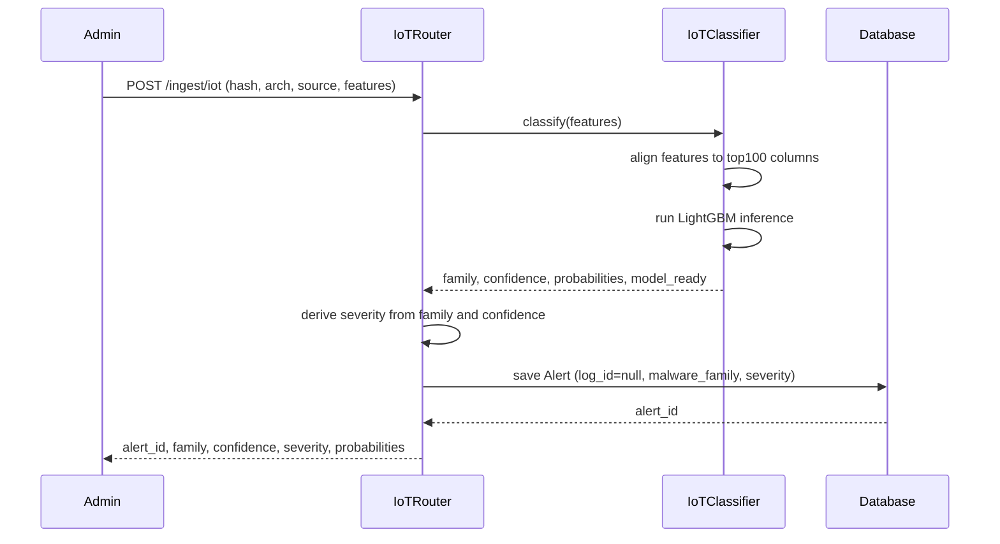

# Sequence Diagrams

## 1. User Login

```mermaid
sequenceDiagram
    participant Client
    participant AuthRouter
    participant AuthService
    participant Database

    Client->>AuthRouter: POST /auth/login (email, password)
    AuthRouter->>AuthService: authenticate_user(email, password)
    AuthService->>Database: query User by email
    Database-->>AuthService: User record
    AuthService->>AuthService: verify password hash
    AuthService-->>AuthRouter: authenticated User
    AuthRouter->>AuthService: create_access_token(email, role)
    AuthService-->>AuthRouter: JWT token
    AuthRouter-->>Client: access_token, token_type, role
```

---

## 2. Log Upload and Anomaly Detection

```mermaid
sequenceDiagram
    participant Admin
    participant AdminRouter
    participant Database
    participant AnomalyService

    Admin->>AdminRouter: POST /admin/upload_logs (file, source)
    AdminRouter->>Database: check for duplicate filename
    Database-->>AdminRouter: no duplicate found
    AdminRouter->>Database: save Log record
    Database-->>AdminRouter: log_id
    AdminRouter->>AnomalyService: detect_anomalies(log_content)
    AnomalyService->>AnomalyService: extract features per line
    AnomalyService->>AnomalyService: run Isolation Forest
    AnomalyService-->>AdminRouter: list of anomalous lines with severity
    AdminRouter->>Database: save Alert records
    AdminRouter-->>Admin: log_id, alerts_generated, source
```

---

## 3. AI Alert Triage

```mermaid
sequenceDiagram
    participant Analyst
    participant AnalystRouter
    participant Database
    participant AIService
    participant Ollama

    Analyst->>AnalystRouter: POST /analyst/alerts/{id}/triage
    AnalystRouter->>Database: get Alert by id
    Database-->>AnalystRouter: Alert record
    AnalystRouter->>Database: get Log by log_id
    Database-->>AnalystRouter: Log content
    AnalystRouter->>AIService: triage_alert(message, severity, log_content)
    AIService->>AIService: extract context window around flagged line
    AIService->>Ollama: POST /api/generate (prompt with context)
    Ollama-->>AIService: raw response text
    AIService->>AIService: parse JSON from response
    AIService-->>AnalystRouter: summary, remediation
    AnalystRouter->>Database: save TriageHistory record
    AnalystRouter->>Database: update Alert status to triaged
    AnalystRouter-->>Analyst: triage_id, ai_response, remediation
```

---

## 4. IoT Sample Classification

```mermaid
sequenceDiagram
    participant Admin
    participant IoTRouter
    participant IoTClassifier
    participant Database

    Admin->>IoTRouter: POST /ingest/iot (hash, arch, source, features)
    IoTRouter->>IoTClassifier: classify(features)
    IoTClassifier->>IoTClassifier: align features to top100 columns
    IoTClassifier->>IoTClassifier: run LightGBM inference
    IoTClassifier-->>IoTRouter: family, confidence, probabilities, model_ready
    IoTRouter->>IoTRouter: derive severity from family and confidence
    IoTRouter->>Database: save Alert (log_id=null, malware_family, severity)
    Database-->>IoTRouter: alert_id
    IoTRouter-->>Admin: alert_id, family, confidence, severity, probabilities
```
