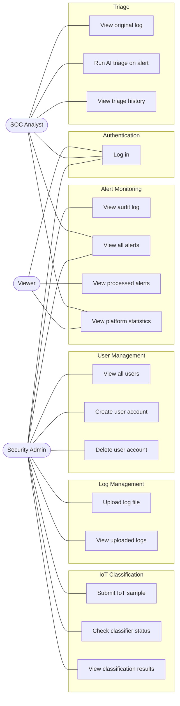

# Use Case Diagram

```mermaid
flowchart LR
    admin(["Security Admin"])
    analyst(["SOC Analyst"])
    viewer(["Viewer"])

    subgraph Authentication
        UC1["Log in"]
    end

    subgraph User Management
        UC2["View all users"]
        UC3["Create user account"]
        UC4["Delete user account"]
    end

    subgraph Log Management
        UC5["Upload log file"]
        UC6["View uploaded logs"]
    end

    subgraph Alert Monitoring
        UC7["View audit log"]
        UC8["View all alerts"]
        UC9["View processed alerts"]
        UC10["View platform statistics"]
    end

    subgraph Triage
        UC11["View original log"]
        UC12["Run AI triage on alert"]
        UC13["View triage history"]
    end

    subgraph IoT Classification
        UC14["Submit IoT sample"]
        UC15["Check classifier status"]
        UC16["View classification results"]
    end

    admin --- UC1
    analyst --- UC1
    viewer --- UC1

    admin --- UC2
    admin --- UC3
    admin --- UC4

    admin --- UC5
    admin --- UC6

    admin --- UC7
    admin --- UC8
    analyst --- UC8
    viewer --- UC9
    viewer --- UC10
    analyst --- UC10

    analyst --- UC11
    analyst --- UC12
    analyst --- UC13

    admin --- UC14
    admin --- UC15
    admin --- UC16
```
