# ThreatLens AI - Frontend Documentation

Written by GZ and FH.

---

## Overview

The frontend is a single-page application built with React and Vite. It serves three separate dashboards based on the authenticated user role, communicates with the FastAPI backend through an Axios service layer, and uses JWT tokens stored in React context for authentication state.

---

## Tech Stack

| Component | Technology | Reason |
|---|---|---|
| Framework | React + Vite | Fast dev server, simple component model |
| Styling | Tailwind CSS | Utility-first, consistent spacing and color without custom CSS files |
| HTTP Client | Axios | Interceptors make it easy to attach the auth token to every request |
| Routing | React Router | Client-side navigation with protected route wrappers |
| Fonts | IBM Plex Sans | Clinical and readable, fits a security tool aesthetic |

---

## Design Decisions

The color palette is built around navy and dark tones to give the platform a focused, professional look that feels appropriate for security work. IBM Plex Sans was chosen over system fonts for the same reason, it reads clearly at small sizes in dense data tables.

The layout uses a fixed sidebar for navigation and a scrollable main content area. Each dashboard shows only the tabs and actions relevant to the user role, nothing is hidden behind disabled buttons, tabs that a role cannot access are simply not rendered.

---

## Routing and Authentication

The app uses protected routes that check the current user role from context before rendering a page. Unauthenticated users are redirected to the login page. After login the backend returns the role alongside the token, and the router redirects automatically to the correct dashboard:

- admin role goes to the Admin dashboard
- analyst role goes to the Analyst dashboard
- viewer role goes to the Viewer dashboard

The Vite dev server is configured to proxy `/api` calls to `http://localhost:8000` so there are no CORS issues during development.

---

## Pages

### Landing Page

The entry point for the application. Presents the platform name and a brief description with a login button.

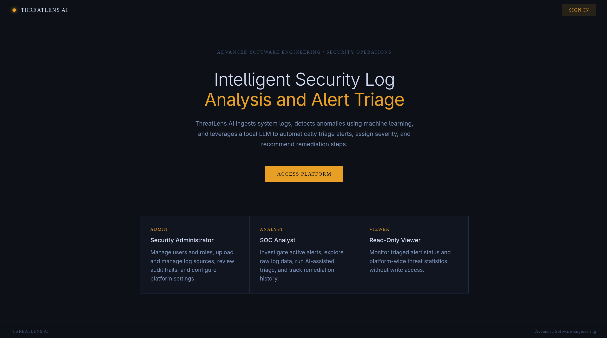

---

### Login

Email and password form with a password reveal toggle. On successful login the token and role are stored in context and the user is redirected to their dashboard.

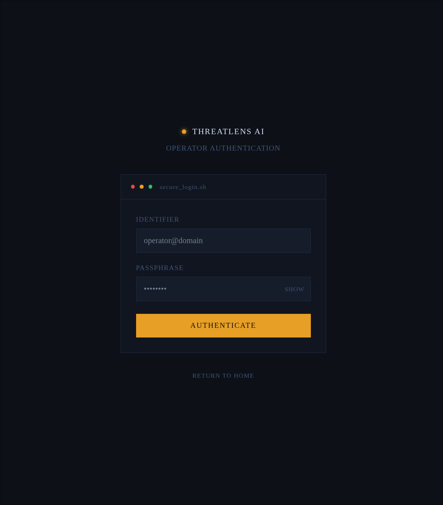

---

### Admin Dashboard

The Admin dashboard is organized into tabs: Overview, User Management, Upload Logs, Audit Log, and IoT Classifier.

**Overview** shows a summary of platform activity.

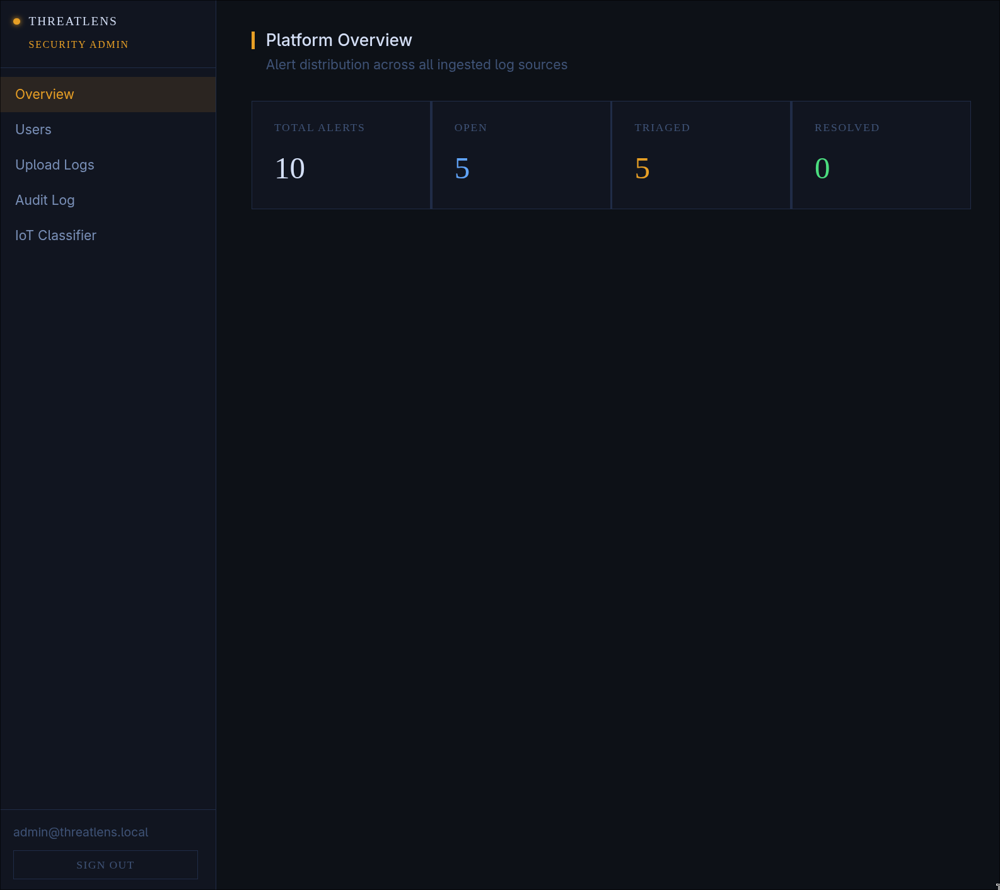

**User Management** lists all registered users and allows the admin to create new accounts with an assigned role or delete existing ones.

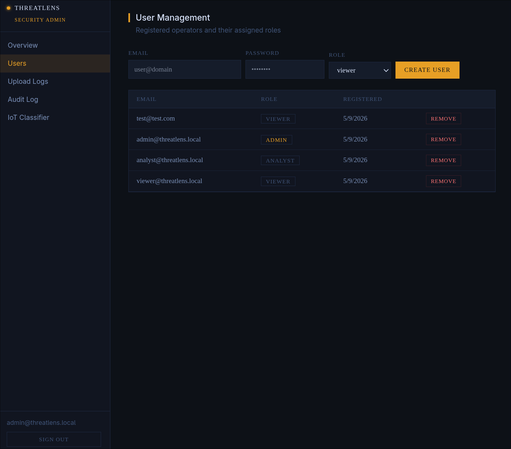

**Upload Logs** provides a file picker and a source label field. On upload the backend runs anomaly detection and returns the number of alerts generated.

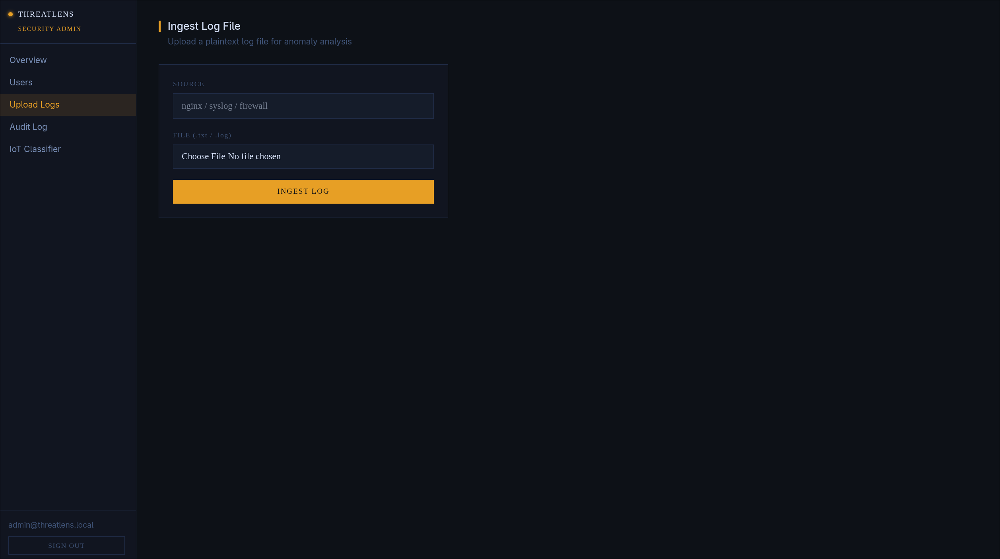

**Audit Log** shows all alerts across the platform in a table with severity, status, source, and a FAMILY column for IoT-sourced alerts. Each family is color-coded using the FamilyBadge component.

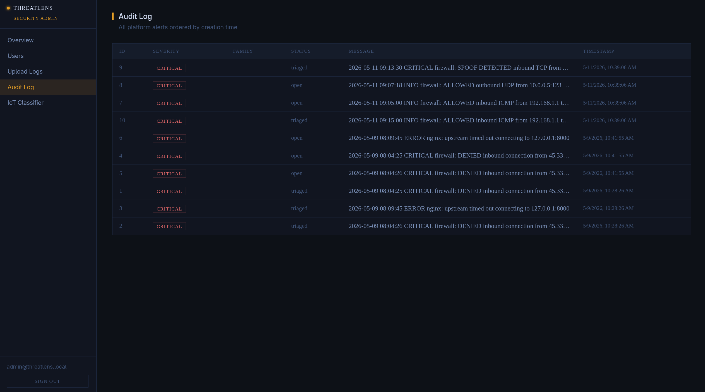

**IoT Classifier** provides a model status indicator, a textarea to paste a JSON feature payload, and a submit button. Results show the predicted family, confidence score, and a bar chart of per-class probabilities.

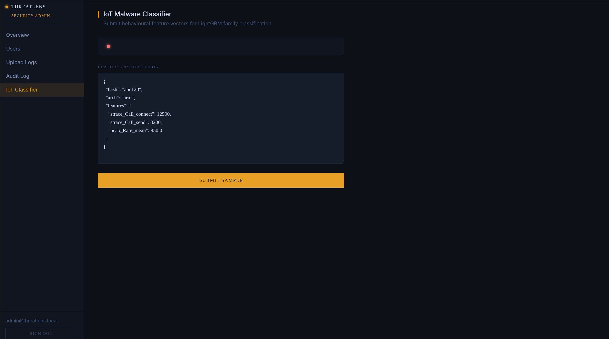

---

### Analyst Dashboard

The Analyst dashboard covers Active Alerts, Log Explorer, Triage Console, and Triage History.

**Active Alerts** lists all alerts with severity badges. Clicking a row opens the alert details.

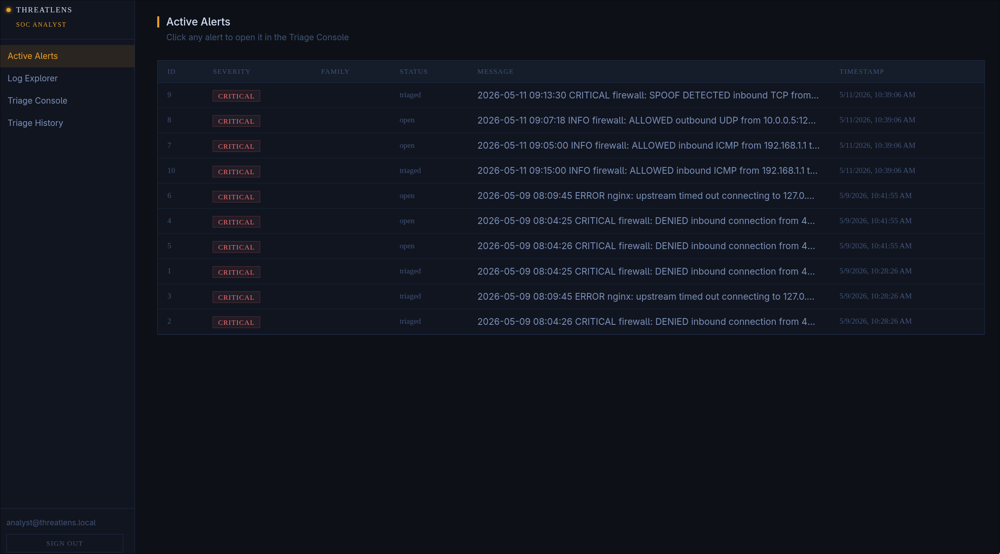

**Triage Console** loads the selected alert with its original log context. The analyst can trigger AI triage from here. The AI response and remediation steps are displayed inline once the backend returns them.

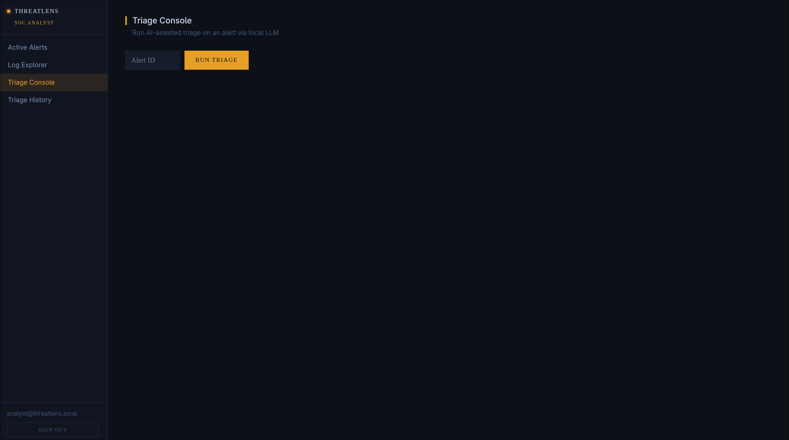

**Triage History** shows a log of all past triage actions including who ran them and what the AI returned.

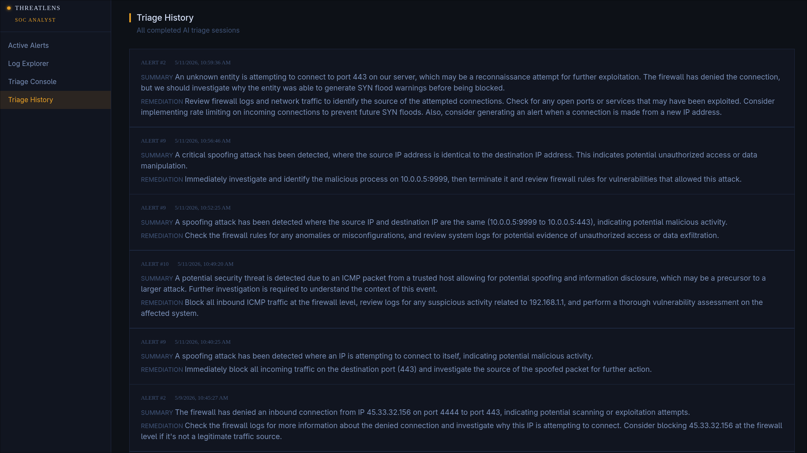

---

### Viewer Dashboard

The Viewer dashboard is read-only. It shows a stats panel with alert counts by status and a table of processed alerts.

**Security Dashboard** displays the platform-level alert counts.

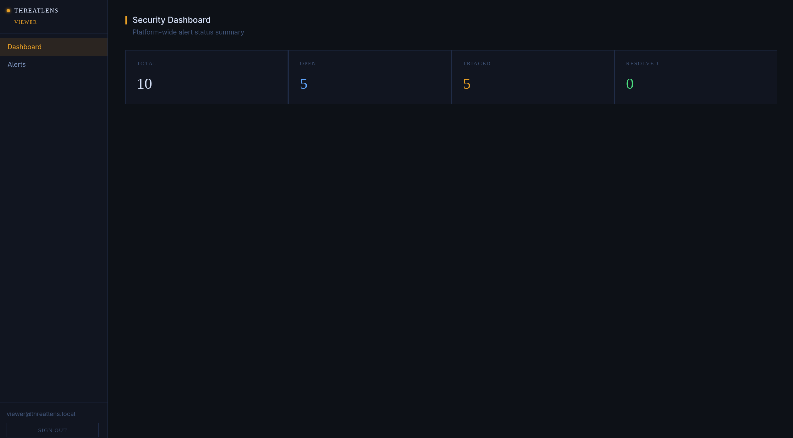

**Alerts** lists all triaged and resolved alerts available to the viewer.

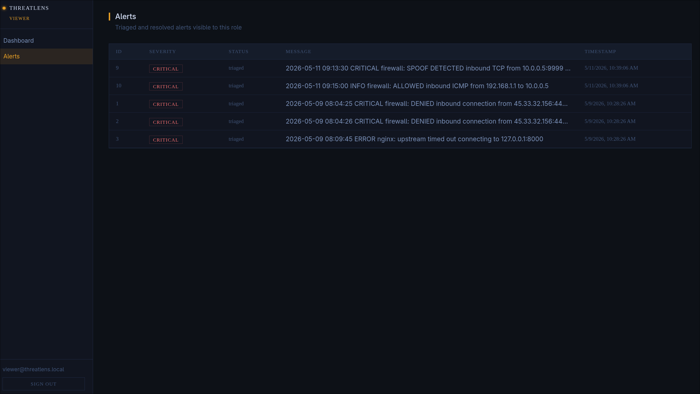
